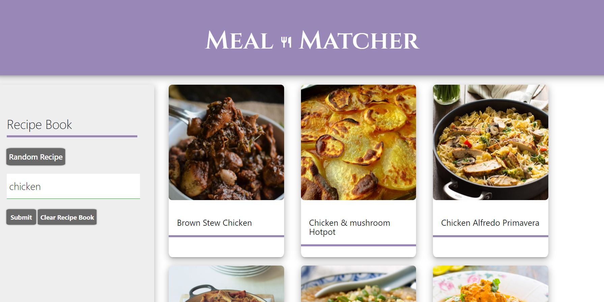
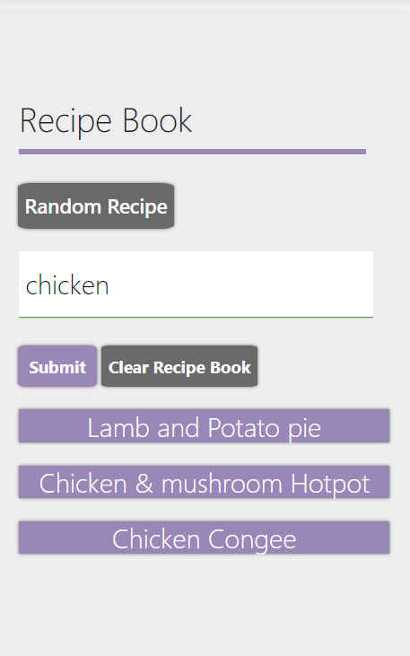

[Meal Matchers Github Pages](https://benimahat1291.github.io/MealMatcher/)

    ## Table of Contents

* [Description](#description)
* [Links](#links)
* [Screenshots](#screenshots)
* [Installation](#installation)
* [Usage](#usage)
* [Technologies Used](#technologies)
* [Collaborators](#collaborators)
* [Contributing](#contributing)
* [Questions](#questions)

## Description

An application that helps you find a meal recipi based on your main ingredient. Makes an Api call to food recipi database. Search by main ingredent to populate the search results. Click on Card to display recipi information. Add the recipi to you bookmarks through local storage.  

## Links

[See the Deployed Meal Matchers on Githubpages](https://benimahat1291.github.io/MealMatcher/)

## Screenshots

Search:

Saved Recipes:

Recipes:

## Installation Instructions

Clone repository and open index.html with your default web browser. 

## Usage

Meal Matchers is a catalouge of food recipies that uses Open recipies API to search for a food recipe based on the main ingredient that is searched for. You can explore all the recipes by searching or hitting the random recipe button. If you like a recipe you can save it to your local storage/ your recipe book to quickly access it. 

This is a vanilla JS application that uses Jquerry and Bootstrap.  

## Technologies Used

 BootStrap, APIs, Jquerry. 

## Collaborators

This app was built by Beni Mahat, Jared, Jessica, Josephino, Tessa

## Contributing

Thank your to Jared, Jessica, Josephino, Tessa for collaborating with me on my first project as a web developer. 

We believe code is never finished, welcome your contributions to enhance the applications functionality. Please adhere to the Code of Conduct for the Contributer Covenant, version 2.0, at https://www.contributor-covenant.org/version/2/0/code_of_conduct.html.

## Questions

If you have further projects and questions, you can find me on Github: [GITHUB](https://github.com/benimahat1291). 
please visit my portfolio to find contact information: [BENI MAHAT](https://benimahat1291.github.io/Portfolio_v2/#/). 